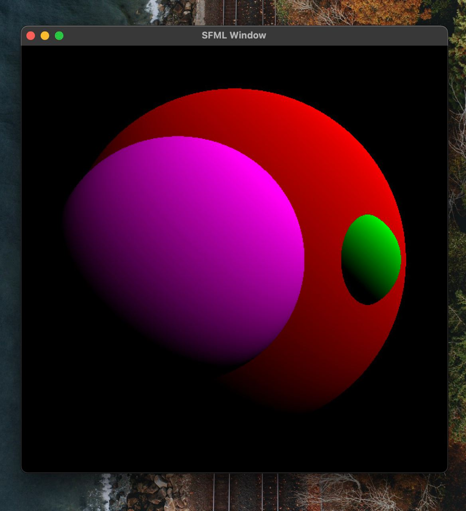
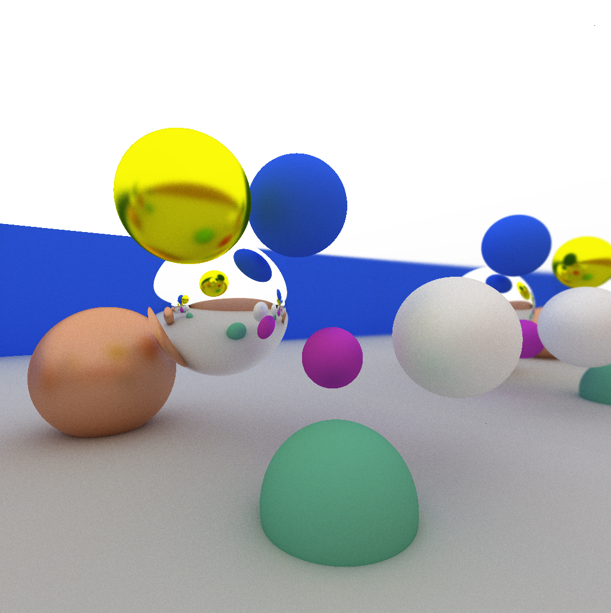

# Meeting Notes

In this file, you are required to take notes for your weekly meetings.
In each meeting, you are required to discuss:

1. What each member has done during the week?
2. Are there challenges or problems? Discuss the possible solutions
3. Plan for the next week for everyone
4. Deviations and changes to the project plan, if any

# Meeting dd.mm.2021 HH::MM

**Participants**:

1. Member 1
2. Member 2
3. Member 3
4. Member 4

## Summary of works

1. Member 1

   Implementing the class XX. Tested the class XX.
   Results are in `tests/<class-xx-tests>`. Resolved the identified problems.

2. Member 2

   Same as above

3. ...

## Challenges

1. The integration of UI with the monsters requires an abstract interface.
2. ...

## Actions

1. Member 1 is going to look into defining an abstract interface for monsters
   to enable easy UI integration.
2. Member 2 is going to work with Member 1 to use abstract interface in derived
   monster classes.
3. Member 2 is going to test the interface.
4. Member 3 is going to use ...

> Please reflect these action decisions in your git commit messages so that
> your group members and advisor can follow the progress.

## Project status

Short summary of current project status.

### TODOs

1. Member 1: Write an action.
2. ...

# Meeting 31.10.2023 12:00

**Participants**: All members

## Summary of works

For the past weekend, each of the members have researched the topic and familiarized themselves with the project
concepts.

On monday Weronica, Johannes and Markus had a quick meeting to discuss the project plan, UML and to write a base for the
project plan.

In this meeting we have:

- Discussed the division of labor
    - We decided that we will divide the classes and topics between two pairs
- Discussed the project structure
- Discussed features
    - Do we want a real time camera control (Yes)
    - Do we need optimization? (Probably)
    - What techniques do we need? (Shadows, reflections, subsurface scattering, etc.)
    - Etc.
- Discussed the schedule
    - In what order do we want to implement the features?
    - What are the milestones
- Implemented the project plan
    - Reviewed, discussed and finalized UML diagram
- Scheduled next meeting

## Challenges

1. In what order should we implement features?
2. What features are necessary and how much time are they likely to take?
3. Project and class structure (UML)
4. Writing this document

## Actions

1. Weronica and Markus are going to start with tangible things like Vector, Objects, FileManager, Camera
2. Johannes and Aleksi are going to start with ray tracing things considered like Rays, Effects, Materials
3. We are aiming to get a working renderer that produces a flat shaded sphere by the project plan deadline or preferably
   earlier

## Project status

Project is planned: Class structure is clear, we have divided ourselves into pairs, we know what features we want to
implement. We have familiarized ourselves with the concepts and algorithms used to implement the project.

# Meeting 08.11.23 13:00

**Participants**: All members

## Summary of works

1. Johannes

   Write Vector class, Ray class, Intersection method for Sphere, Triangle class, simple testfiles for vector, ray,
   sphere and triangle.

2. Markus

   Wrote FileManager, Object, Colour, and Material classes and test for writing image.

3. Aleksi

   Set up SFML library for creating windows and drawing to them, put together a simple flat shaded ray tracer, created
   camera and scene classes, implemented pipeline for rendering multiple objects and added simple ambient lighting for
   shading. General changes to vectors and project refactoring

## Challenges

1. We had some issues getting the project building on setups other than CLion. Everyone is now using CLion :) Something
   else has to be figured out though.

## Actions

1. Johannes is going to work on the camera class, implementing some sort of controls for camera movement and possibly
   parameters for FOV etc.
2. Markus is going to work on ray bounces and emissive materials
3. Weronica is going to remove coupling with SFML and add input functionality
4. Aleksi is going to help with the Camera class and possibly work on material and reflections

## Project status

Project is set up, basic tests are implemented, and we have a simple shaded render.

# Meeting 17.11.23 12:00

**Participants**: All members

## Summary of works

1. Johannes

2. Markus
   
   Worked on PathTracer class: Path tracing algorithm.
   Worked on Material class: Specular, emissive, and diffuse materials. 

3. Aleksi

   Work on camera class: Fov, movement, rotation and utility. Window resizing.

4. Weronica

## Challenges

1. Camera class had some bugs that were fixed, same goes for ray accumulation

## Actions

1. Aleksi will work on GPU acceleration next
2. Markus will work on translucent materials (Refractions)
3.
4.

## Project status

We have camera movement, fov, ray accumulation and basic materials.

Upcoming features (if time allows):

- [ ] GPU Acceleration
- [ ] Refractions
    - [ ] Subsurface scattering?
    - [ ] Volumetric rendering?
- [ ] Triangle meshes
- [ ] Load models from files (.obj)
- [ ] Animation / Blur?
