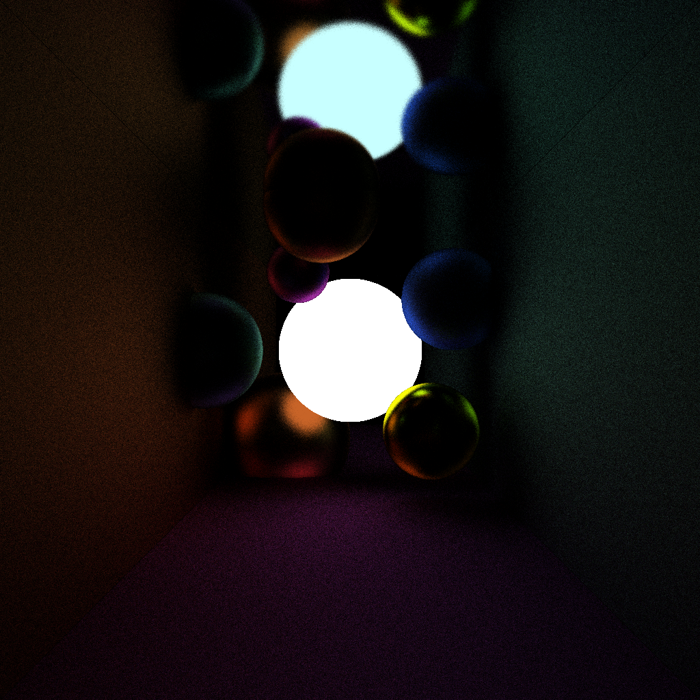

# Path Tracing

## Group
- Aleksi Lassila
- Johannes Karhapää
- Markus Lång
- Weronika Klatka

## Documentation

The project documentation and screenshots can be found in [doc/Documentation.pdf](/doc/Documentation.pdf).
The major features include:
 - Scene files using .json format
 - Objects, such as spheres, triangles, parallelograms
 - Advanced materials
 - Monte Carlo integration
 - Real time preview and camera movement & controls
 - Multithreaded rendering on CPU
 - Saving the result in a file

## Additional Screenshots

